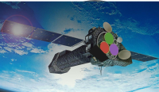

  

# SpectralFitting.jl

Spectral fitting routines and models with a focus on X-ray astronomy. This project is an attempt to modernise the field with new and advancements in computational methods and statistical methods. SpectralFitting.jl aims to be extensible and reproducible, such that fits may be easily tailored to new and specific problems, and easily verified by others.

See the [documentation](https://fjebaker.github.io/SpectralFitting.jl/dev/) for more. Please note that the documentation is heavily lagging behind features. PRs and issues are very welcome.
